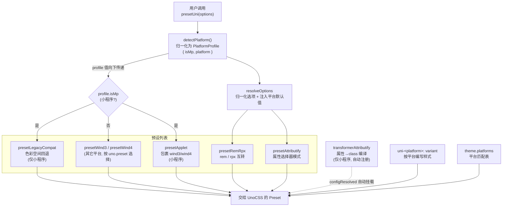

# 贡献指南

感谢你对 `@uni-helper/unocss-preset-uni` 的兴趣！本文档介绍项目架构与开发流程，帮助你快速参与贡献。

## 项目定位

`@uni-helper/unocss-preset-uni` 是一个面向 [uni-app](https://github.com/dcloudio/uni-app) 的 UnoCSS 预设入口。它本身**不重新实现** UnoCSS 的规则引擎，而是根据当前编译平台（`@uni-helper/uni-env` 的 `isMp` 把平台分成「小程序」与「其它」两类）在以下上游预设与转换器之间自动选择并组装：

- 小程序平台：使用 [`unocss-applet`](https://github.com/unocss-applet/unocss-applet) 的 `presetApplet`（包裹 wind3/wind4 并做小程序语法兼容），并自动叠加 `@unocss/preset-legacy-compat`（色彩空间回退）与 `transformerAttributify`（把属性用法编译成 class）；
- 其它平台（H5、App、快应用等）：直接使用 [`@unocss/preset-wind3`](https://unocss.dev/presets/wind3)（默认）/ [`@unocss/preset-wind4`](https://unocss.dev/presets/wind4)。

此外内置 `presetRemRpx`、`presetAttributify` 与按平台编写样式（`uni-<platform>:`）的 variant。

## 环境要求

| 依赖 | 版本 |
| --- | --- |
| Node | 26（见 `.node-version` 与 `package.json` 的 `devEngines`） |
| pnpm | 12.3.4（见 `package.json` 的 `packageManager`） |

建议启用 [corepack](https://nodejs.org/api/corepack.html) 自动切换 pnpm 版本：`corepack enable`。

## 技术栈

- **单包仓库**：pnpm workspace + [catalog](https://pnpm.io/catalogs) 集中管理依赖版本（`pnpm-workspace.yaml`）
- **构建**：[tsdown](https://github.com/rolldown/tsdown)（rolldown 驱动，ESM-only 产物）
- **类型检查**：`tsc --noEmit`（`tsconfig.json` 仅 `include: ["src"]`）
- **Lint**：[@uni-helper/eslint-config](https://github.com/uni-helper/eslint-config)（基于 antfu 的 flat config）
- **示例**：`playground/`（uni-app + Vue3 + Vite，作为集成验证与开发预览）

## 目录结构

```
.
├── src/                 # 预设源码（发布的包内容）
│   ├── index.ts         # 入口，重新导出 presetUni 与类型
│   ├── preset-uni.ts    # 预设主入口，探测平台并组装 presets/variants/theme/transformers
│   ├── platform.ts      # 平台探测：detectPlatform() 归一化为 PlatformProfile 值
│   ├── options.ts       # 用户选项归一化（boolean|T → false|T，注入平台默认值）
│   ├── presets.ts       # 按 PlatformProfile 构造 preset 列表（核心分支逻辑）
│   ├── transformers.ts  # 小程序 attributify transformer 装配
│   ├── variants.ts      # uni-<platform>: 按平台编写样式
│   ├── theme.ts         # theme.platforms 平台匹配表
│   └── types.ts         # 选项与对外类型
├── test/                # 单元测试（vitest），对两端 profile 各跑一遍分支
├── playground/          # uni-app 集成示例（开发预览，不发布）
├── tsdown.config.ts     # 构建配置
├── pnpm-workspace.yaml  # workspace 与 catalog 定义
└── package.json
```

> `dist/` 由 `pnpm build` 生成，已在 `.gitignore` 中，不提交。

## 架构与数据流

下图展示 `presetUni()` 被调用后，如何根据平台（`@uni-helper/uni-env` 的 `isMp`）组装最终交给 UnoCSS 的内容。



**关键点：**

- 平台判定在 `presetUni()` 入口探测一次（`detectPlatform()`），得到 `PlatformProfile`（`{ isMp, platform }`），再作为值向下传给 `resolveOptions` / `createPresets` / `createTransformers` / `createVariants`。这样 builder 不再各自 import `@uni-helper/uni-env`，分支逻辑可在单测中显式构造两种 profile 各跑一遍。
- `options.uno.preset` / `options.uno.presetOptions` 在小程序与其它平台**两端均生效**：小程序整体透传给 `presetApplet`，其它平台直接据此选择 `presetWind3` / `presetWind4`。
- 小程序端额外叠加 `presetLegacyCompat`：小程序 wxss 不支持 `oklch`/`oklab` 等新色彩空间，该预设把 `color()` 中的色彩空间回退为兼容写法。
- `transformerAttributify` 仅小程序平台需要并在 `configResolved` 中自动注册：小程序 wxss 不支持属性选择器（如 `[un-text='']`），必须在构建期把属性用法编译成 `class`；其它平台上游 `preset-attributify` 的属性选择器即可工作。
- `presetRemRpx` 两端默认值不同：小程序端不显式传 `mode`，由 `presetRemRpx` 默认走 `rem2rpx`（rem→rpx）；其它平台传 `mode: 'rpx2rem'`（保留 rem）。

## 源码各文件职责

| 文件 | 职责 |
| --- | --- |
| `src/preset-uni.ts` | 预设主入口。调用 `detectPlatform()` 探测一次平台，把 `PlatformProfile` 向下传递给各 builder，组装 presets/variants/theme，并在 `configResolved` 中自动挂载 transformer。 |
| `src/platform.ts` | 平台探测。`detectPlatform()` 把 `@uni-helper/uni-env` 的模块级常量（`isMp`、`platform`）归一化为 `PlatformProfile` 值；env 导入只留在此文件，builder 通过入参拿到 profile，便于测试覆盖两端分支。 |
| `src/options.ts` | 把每项 `boolean \| T \| undefined` 选项归一化为 `false \| T`，按传入的 `PlatformProfile` 注入平台相关默认值（小程序 attributify 忽略 `block`/`fixed`；remRpx 两端 mode 不同）。 |
| `src/presets.ts` | 核心分支逻辑：按 `PlatformProfile.isMp` 在 `presetApplet` 与 `presetWind3`/`presetWind4` 间切换，小程序叠加 `presetLegacyCompat`，再按开关加入 `presetRemRpx`、`presetAttributify`。 |
| `src/transformers.ts` | 构造需自动注册的源码 transformer 列表。仅小程序平台且开启 attributify 时返回 `transformerAttributify`，其它平台返回空数组。 |
| `src/variants.ts` | `uni-<platform>:` 平台条件变体。构建场景仅命中当前编译平台时剥离 `uni-xxx:` 前缀，不命中平台返回 undefined（无产出）；非构建场景（`UNI_PLATFORM` 未注入）剥离所有平台前缀，使 VSCode 能提供悬浮提示与补全，真实生效与否仍由构建时平台过滤决定。 |
| `src/theme.ts` | 由 `@uni-helper/uni-env` 的 `builtInPlatforms` 派生 `theme.platforms` 匹配表（含去掉 `mp-` 前缀的别名）。 |
| `src/types.ts` | `UserUniPresetOptions`、`UniPresetOptions`、`ResolvedUniPresetOptions` 等对外类型。 |

## 开发流程

```bash
# 1. 安装依赖
pnpm install

# 2. 开发模式（tsdown watch，源码改动实时重建 dist）
pnpm dev

# 3. 构建（产出 dist/index.mjs + dist/index.d.mts，ESM-only）
pnpm build

# 4. 类型检查
pnpm typecheck

# 5. 单元测试（对小程序与其它平台两种 PlatformProfile 各跑一遍分支逻辑）
pnpm test

# 6. Lint（自动修复）
pnpm lint:fix
```

### 调试 playground

修改源码后，可在真实 uni-app 集成环境验证：

```bash
pnpm play:h5           # H5
pnpm play:mp-weixin    # 微信小程序（需在微信开发者工具中预览）

# 或构建产物
pnpm build:h5
pnpm build:mp-weixin
```

playground 通过 `workspace:*` 引用本包，`pnpm dev` 持续重建 `dist/` 后即可在 playground 中看到改动效果。

> 小程序端编译依赖原生工具链与平台插件，真机预览需在微信开发者工具中完成。

## 依赖版本管理（catalog）

所有依赖（**含 peerDependencies**）通过 `pnpm-workspace.yaml` 的**命名 catalog** 集中管理版本，`package.json` 中以 `catalog:<name>` 引用：

| catalog | 用途 | 典型条目 |
| --- | --- | --- |
| `unocss` | 与 unocss-applet 对齐，统一锁上游版本 | `unocss`、`unocss-applet`、`@unocss/preset-mini`、`@unocss/preset-legacy-compat`、`@unocss/rule-utils` 等 |
| `uni-app` | playground 的 uni-app 框架与配套依赖 | `@dcloudio/*`、`vue`、`vue-i18n`、`vue-tsc`、`@iconify-json/carbon` |
| `vite` / `typescript` / `types` / `utils` / `eslint` | 通用工具链 | `vite`、`vitest`、`typescript`、`@types/node` 等 |

升级某个依赖时，改 `pnpm-workspace.yaml` 中对应 catalog 条目即可，主包与 playground、peer 与普通依赖全部同步生效。

## 贡献规范

### Commit message

遵循 [Conventional Commits](https://www.conventionalcommits.org/)：

```
feat(presets): support wind4 on H5
fix(variants): correct platform alias matching
docs: add CONTRIBUTING guide
chore(deps): bump unocss catalog
build: migrate from unbuild to tsdown
```

类型前缀：`feat`、`fix`、`docs`、`style`、`refactor`、`perf`、`test`、`build`、`ci`、`chore`。

### PR 流程

1. Fork 仓库并从 `main` 切出特性分支。
2. 确保 `pnpm typecheck`、`pnpm lint`、`pnpm test`、`pnpm build` 全部通过。
3. 若改动影响生成 CSS，在 `playground/` 中验证 H5 与小程序两端产物。
4. 关联相关 issue。

## 发布流程

发布由维护者通过 [bumpp](https://github.com/antfu/bumpp) 完成：

```bash
pnpm release
```

这会交互式升版本号、打 tag、推送，随后由 CI（GitHub Actions `.github/workflows/release.yml`）在收到 `v*` tag 时触发 `prepublishOnly`（即 `pnpm build`）并发布到 npm。贡献者无需关心发布。

> 版本对齐：本预设的 `peerDependencies`（`unocss`、`unocss-applet`）通过 `catalog:unocss` 管理，升级上游时改 catalog 条目即可，消费者安装时由 pnpm 按 peerDependencies 提示对齐。
